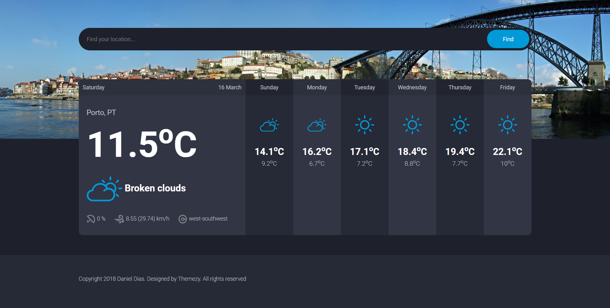

# WeatherApp-node-express

A simple Weather App

## Getting started

### Requirements
 - Node Version > 8.3.0 (ES6 Support)
 - NPM stable release
 - weatherbit.io apiKey

### Setup

1. Install via [npm](http://npmjs.org): 
```
npm install
```
2. create a new file config/server.json
3. Add configurations to the file server.json
```
{
    "host" : "your-host",
    "port" : "your-port"
    "apikey": "your weatherbit.io apiKey"
}
```

4. Start the page with:
```
npm run start
```

## Example

## License

MIT © [Daniel Maia Dias]